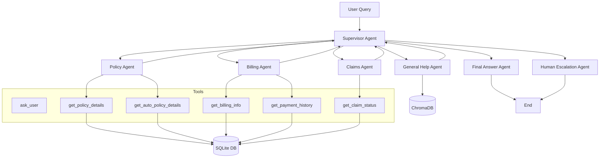

# 🤖 A Multi-Agent AI System for Automated Insurance Support

**A production-ready, full-stack project featuring a multi-agent AI system for automating insurance customer support, built with LangGraph, OpenAI GPT, ChromaDB (RAG), and a complete React + Node.js web application.**

---

## 🎯 Project Overview

This project delivers a **Multi-Agent AI System** designed to automate insurance customer support. The system intelligently routes customer queries to specialized AI agents — each with deep domain knowledge in policies, billing, claims, or general insurance FAQs — eliminating the need for human involvement in routine support tasks.

The project demonstrates the full lifecycle of an AI-powered enterprise application:

- **Research & Design** — LangGraph-based multi-agent orchestration
- **Backend Intelligence** — Python Flask API exposing the multi-agent system as a REST service
- **Web Platform** — A complete Node.js + React full-stack application
- **Observability** — Arize Phoenix integration for LLM tracing and monitoring

### Core Value Propositions

| Feature                                     | Description                                                           |
| ------------------------------------------- | --------------------------------------------------------------------- |
| 🧠**Semantic Intent Classification**  | Uses GPT-5-mini to accurately classify user intent before routing     |
| 🔀**Intelligent Multi-Agent Routing** | Supervisor agent dynamically routes queries to the right specialist   |
| 📚**RAG-Powered FAQ**                 | ChromaDB + TF-IDF vectorization over the InsuranceQA-v2 dataset       |
| 😡**Sentiment-Aware Escalation**      | TextBlob sentiment analysis triggers automatic human escalation       |
| 🖼️**Vision/Multimodal**             | Upload vehicle/property damage images for AI adjuster analysis        |
| 🎙️**Voice Input/Output**            | Speech recognition & synthesis for accessibility                      |
| 📊**Real-Time Analytics**             | Live dashboard tracking policies, claims, billing, and AI performance |
| 🔔**Proactive Notifications**         | System auto-alerts users of upcoming bill due dates                   |
| 🔐**Role-Based Access Control**       | Admin, Agent, and Customer roles with JWT authentication              |

---

### Communication Flow

```
User → React Frontend
     → [Socket.IO] → Node.js Backend
     → [HTTP POST]  → Python Flask API
     → [LLM Call]   → Supervisor Agent (GPT-5-mini intent classification)
     → [Route]      → Specialist Agent (Policy/Billing/Claims/General/Escalation)
     → [DB Query]   → SQLite + ChromaDB
     → [LLM Augment]→ GPT-5-mini (response generation)
     → Response bubbles back through the stack to the user
```

---

## 🛠️ Technology Stack

### AI / Machine Learning Layer

| Technology             | Version      | Purpose                                            |
| ---------------------- | ------------ | -------------------------------------------------- |
| LangGraph              | 0.0.64       | Multi-agent orchestration framework                |
| LangChain              | 0.0.350      | LLM integration utilities                          |
| OpenAI GPT-5-mini      | via API      | Intent classification, response generation, vision |
| ChromaDB               | 0.4.18       | Persistent vector store for RAG                    |
| Sentence Transformers  | latest       | Semantic embeddings                                |
| Scikit-learn TF-IDF    | latest       | Fallback FAQ retrieval (60K features)              |
| TextBlob               | latest       | Sentiment analysis for escalation                  |
| Arize Phoenix          | 3.0.0        | LLM observability and tracing                      |
| InsuranceQA-v2 Dataset | Hugging Face | Domain-specific FAQ knowledge base                 |

### Backend Layer

| Technology         | Version | Purpose                           |
| ------------------ | ------- | --------------------------------- |
| Python Flask       | 3.0.0   | Multi-agent REST API server       |
| Flask-CORS         | 4.0.0   | Cross-origin resource sharing     |
| Node.js            | ≥ 18   | Application backend runtime       |
| Express.js         | 4.18.2  | Node.js web framework             |
| Socket.IO          | 4.7.4   | Real-time WebSocket communication |
| SQLite3            | 5.1.6   | Primary relational database       |
| JWT (jsonwebtoken) | 9.0.2   | Authentication tokens             |
| bcryptjs           | 2.4.3   | Password hashing                  |
| Helmet.js          | 7.1.0   | HTTP security headers             |
| express-rate-limit | 7.1.5   | API rate limiting                 |
| Winston            | 3.11.0  | Structured logging                |
| Joi                | 17.11.0 | Input validation                  |
| Axios              | 1.6.2   | HTTP client                       |

### Frontend Layer

| Technology        | Version | Purpose                           |
| ----------------- | ------- | --------------------------------- |
| React             | 18.2.0  | UI framework                      |
| React Router DOM  | 6.20.1  | Client-side routing               |
| Material UI (MUI) | 5.15.0  | Component library                 |
| MUI X Charts      | 6.18.3  | Analytics charts (Line, Pie, Bar) |
| Socket.IO Client  | 4.7.4   | WebSocket client                  |
| React Markdown    | 10.1.0  | Render agent Markdown responses   |
| jsPDF             | 4.1.0   | PDF document generation           |
| date-fns          | 2.30.0  | Date utilities                    |
| Web Speech API    | Browser | Voice input (STT) & output (TTS)  |

---

## 🤖 Multi-Agent System Core

The heart of this project is a **LangGraph-orchestrated multi-agent pipeline** defined in `multi-agent-system/api_server.py`

### Agent Architecture Overview

```
                    ┌─────────────────┐
    User Query ───► │ Supervisor Agent │
                    │ (GPT Intent      │
                    │  Classification) │
                    └────────┬────────┘
                             │
            ┌────────────────┼─────────────────┬──────────────┐
            ▼                ▼                  ▼              ▼
    ┌──────────────┐ ┌─────────────┐  ┌──────────────┐ ┌────────────┐
    │ Policy Agent │ │Billing Agent│  │ Claims Agent │ │General Help│
    │              │ │             │  │              │ │   Agent    │
    │ get_policy   │ │get_billing  │  │get_claim_stat│ │ ChromaDB   │
    │ get_auto_    │ │get_payment  │  │              │ │ TF-IDF RAG │
    │ policy_det.  │ │_history     │  │              │ │ + GPT-5    │
    └──────────────┘ └─────────────┘  └──────────────┘ └────────────┘
            │                                               │
            └───────────────────────────────────────────────┘
                                    │
                    ┌───────────────┴──────────────┐
                    ▼                              ▼
            ┌──────────────┐            ┌──────────────────┐
            │   Vision     │            │ Human Escalation │
            │   Agent      │            │     Agent        │
            │ (GPT-5 Vision│            │ (keyword/senti-  │
            │  multimodal) │            │  ment/failure    │
            └──────────────┘            │  based trigger)  │
                                        └──────────────────┘
```

### 1. Supervisor Agent (Intelligent Router)

**File**: `multi-agent-system/api_server.py` → `supervisor_agent_logic()`

The Supervisor Agent is the **central decision-maker** that receives every user query and determines which specialist agent should handle it.

**Routing Strategy — Two-Stage**:

**Stage 1: Semantic Routing via LLM**

```python
_classify_intent_with_llm(user_query, customer_id, policy_number)
```

- Sends the query + context to GPT-5-mini for JSON-structured intent classification
- Returns one of 6 intents: `policy_details`, `billing_inquiry`, `check_claim_status`, `file_claim`, `general_inquiry`, `escalation`
- Returns confidence score (0.0–1.0)
- Routes if confidence > 0.6

**Stage 2: Rule-Based Routing**

- Triggered if LLM confidence ≤ 0.6 or API fails
- Keyword matching on `billing`, `claim`, `policy`, `accident`, `coverage`, etc.
- Context-aware (requires `customer_id` or `policy_number` for transactional intents)

**Escalation Pre-Check** (before routing):

```
1. Keyword trigger: "human", "lawsuit", "fraud", "cancel policy now"
2. Sentiment trigger: TextBlob polarity < -0.3
3. Failure trigger: 3+ consecutive failed lookups in session
```

**Session State Management**:

- Maintains per-session state (`_session_state` dict) with: `pending`, `intent`, `customer_id`, `policy_number`, `turns`, `failures`, `last_agent`, `escalated`
- Supports multi-turn disambiguation (e.g., asking the user to select a policy)
- Remembers context across turns so users don't repeat themselves

---

### 2. Policy Agent

**File**: `multi-agent-system/api_server.py` → `process_policy_query()`

Handles all policy-related customer inquiries.

**Capabilities**:

- **List All Policies**: Detects "list", "show my policies", "all policies" intents and returns a comprehensive summary of all policies for a customer
- **Single Policy Lookup**: Fetches details for a specific `policy_number` from SQLite
- **Smart Policy Picker** (`_pick_policy_for_customer()`):
  - Extracts explicit policy number from text (regex: `POL\d+`)
  - Detects policy type hints ("my auto policy", "home coverage")
  - Falls back to most recently started active policy
  - Handles ambiguity: prompts user to choose when multiple match
- **Policy Type Enrichment**: Fetches auto-specific details (vehicle make/model/VIN/year) and life-specific details (coverage amount, term length, insured age)
- **LLM-Augmented Responses**: Uses GPT-4o-mini to generate natural language responses from structured DB data

**Database Tables Used**: `policies`, `auto_policy_details`, `life_policy_details`, `customers`

---

### 3. Billing Agent

**File**: `multi-agent-system/api_server.py` → `process_billing_query()`

Handles all payment and billing inquiries.

**Capabilities**:

- Fetches current pending bill (amount due, due date) for a policy or customer
- Fetches payment history (last 10 payments: date, amount, method)
- Handles "no pending invoice" gracefully (falls back to premium amount from policy)
- Detects "history" intent to include last payment details in response
- All responses are LLM-generated natural language from structured data

**Database Tables Used**: `billing`, `payments`, `policies`

---

### 4. Claims Agent

**File**: `multi-agent-system/api_server.py` → `process_claims_query()`

Handles claim status checking and claim-related inquiries.

**Capabilities**:

- **Claim ID Extraction**: Regex-based extraction of `CLM\d+` from user text
- **Multi-Level Lookup**: By claim ID → by policy number → by customer ID
- **Claim Status Summary**: Returns latest claim with incident type, estimated loss, settlement amount, status
- **Claim History**: Returns last 10 claims for a customer
- Filing new claims is handled via the REST API (authenticated `POST /api/claims/file`)

**Database Tables Used**: `claims`, `policies`

---

### 5. General Help Agent (RAG + OpenAI)

**File**: `multi-agent-system/api_server.py` → `process_general_help_query()`

Answers general insurance questions using a **Retrieval-Augmented Generation (RAG)** pipeline.

**RAG Pipeline**:

```
User Query
    │
    ▼
_retrieve_faq(query, top_k=3)
    │
    ├── Backend: ChromaDB (Primary)
    │       query_texts=[query]
    │       semantic similarity search
    │       InsuranceQA-v2 collection
    │
    └── Backend: TF-IDF (Fallback)
            TfidfVectorizer (60K features)
            cosine_similarity()
            threshold: score >= 0.15
    │
    ▼
_filter_faq_matches_by_hint()  ← Policy type filter (auto/home/life/health)
    │
    ▼
Build context string (top 3 matches)
    │
    ▼
GPT-5-mini (RAG prompt)  ← "Use the following context to answer..."
    │
    ▼
Natural Language Response
```

**Knowledge Base Loading** (`_build_faq_index_async()`):

- Runs in a **background daemon thread** on startup
- Primary: Connects to ChromaDB persistent collection at `./chroma_db`
- Fallback: Downloads `deccan-ai/insuranceQA-v2` from Hugging Face, builds TF-IDF index
- Logs: ✅ FAQ index ready (N Q/A pairs)

**Policy Type Hint Filtering**: Detects mention of "auto", "home", "life", "health" and filters FAQ results to those domains.

---

### 6. Human Escalation Agent

**File**: `multi-agent-system/api_server.py` → `_should_escalate()`

A **safety mechanism** that intercepts queries before routing when human intervention is needed.

**Trigger Conditions**:

| Trigger             | Condition                                                                            |
| ------------------- | ------------------------------------------------------------------------------------ |
| Keyword Trigger     | "human", "representative", "real agent", "call me", "phone call", "speak to someone" |
| Legal/Fraud Trigger | "complaint", "lawsuit", "legal", "fraud", "police", "cancel policy now"              |
| Sentiment Trigger   | TextBlob polarity < -0.3 (very negative user sentiment)                              |
| Failure Trigger     | 3+ consecutive failed lookups in the same session                                    |

**Response**: Marks session as `escalated = True` to prevent repeated triggers, notifies the user, and the Node.js backend marks the chat session as escalated in the database.

---

### 7. Vision Agent (Multimodal)

**File**: `multi-agent-system/api_server.py` → `_answer_general_chatgpt_style()` with `image_data`

Activated when a user uploads an image along with their message.

**Capabilities**:

- Bypasses standard routing pipeline entirely
- Sends base64-encoded image + text query to GPT-5-mini with Vision capability
- System role: "Expert insurance adjuster AI" — analyzes vehicle damage, documents, property issues
- Frontend supports image uploads up to 5MB, previewed before sending

**Frontend Integration** (`Chat.js`):

```
User clicks image icon → FileReader → base64 Data URL
→ sendMessage(conversationId, text, { image: base64DataUrl })
→ Node.js backend → Python /api/process-query { image: base64 }
→ GPT-5 Vision response
```

---

## 🐍 Python API Server (Flask)

**File**: `multi-agent-system/api_server.py` —

### REST API Endpoints

| Method   | Endpoint                         | Description                                                                  |
| -------- | -------------------------------- | ---------------------------------------------------------------------------- |
| `GET`  | `/health`                      | Health check + FAQ index status + backend type                               |
| `POST` | `/api/process-query`           | **Main chat endpoint** — processes queries through multi-agent system |
| `GET`  | `/api/agent-status`            | Status of all 5 agents + DB connection                                       |
| `GET`  | `/api/policy/<policy_number>`  | Direct policy detail lookup                                                  |
| `GET`  | `/api/claims`                  | Claims lookup by `claim_id` or `policy_number`                           |
| `GET`  | `/api/billing`                 | Billing info by `policy_number` or `customer_id`                         |
| `GET`  | `/api/notifications/proactive` | Upcoming bills within 7 days for a customer                                  |

### `/api/process-query` Request/Response

**Request Body**:

```json
{
  "query": "What is my premium for policy POL000001?",
  "customer_id": "CUST00001",
  "policy_number": "POL000001",
  "session_id": "uuid-session-id",
  "conversation_history": "User: Hello\nAssistant: Hi!",
  "image": "data:image/jpeg;base64,..."
}
```

**Response**:

```json
{
  "success": true,
  "data": {
    "response": "Your premium for policy POL000001 is **$150/month**...",
    "agent": "policy_agent",
    "next_agent": "policy_agent",
    "status": "completed",
    "confidence": 0.92,
    "metadata": {
      "policy_number": "POL000001",
      "found": true,
      "policy_type": "auto",
      "llm": true,
      "routing": {
        "next_agent": "policy_agent",
        "department": "Policy",
        "confidence": 0.92,
        "reason": "semantic_policy"
      }
    },
    "timestamp": "2026-05-23T07:00:00.000Z"
  }
}
```

### Key Helper Functions

| Function                            | Purpose                              |
| ----------------------------------- | ------------------------------------ |
| `_classify_intent_with_llm()`     | GPT-5 intent classification → JSON |
| `_analyze_sentiment()`            | TextBlob polarity scoring            |
| `_should_escalate()`              | Multi-condition escalation check     |
| `_extract_policy_number()`        | Regex `POL\d+` extraction          |
| `_extract_claim_id()`             | Regex `CLM\d+` extraction          |
| `_detect_policy_type_hint()`      | Auto/home/life/health detection      |
| `_pick_policy_for_customer()`     | Smart policy disambiguation          |
| `_retrieve_faq()`                 | ChromaDB or TF-IDF retrieval         |
| `_build_faq_index_async()`        | Background FAQ index builder         |
| `_answer_general_chatgpt_style()` | GPT-4o-mini + optional vision        |

---

## 🟢 Node.js Backend (Express.js)

**File**: `insurance-ui-backend/server.js`

### Architecture

```
server.js
├── config/
│   └── realDatabase.js       ← SQLite connection, WAL mode, schema migration
├── routes/
│   ├── auth.js               ← JWT login/register/profile/password
│   ├── chat.js               ← Chat query, history, sessions, escalation
│   ├── policy.js             ← Policy CRUD operations
│   ├── claims.js             ← Claims filing, lookup, search, stats
│   ├── billing.js            ← Billing and payment management
│   ├── analytics.js          ← Dashboard analytics, agent performance
│   ├── documents.js          ← Document management
│   ├── notifications.js      ← Notification endpoints
│   └── settings.js           ← User settings management
├── services/
│   ├── authService.js        ← JWT + bcrypt auth, user CRUD, customer creation
│   ├── chatStorage.js        ← Chat session/message persistence
│   ├── realMultiAgentIntegration.js ← Python API proxy + auto-startup
│   └── settingsStorage.js    ← Per-customer settings persistence
├── socket/
│   └── handlers.js           ← Socket.IO event handlers
└── utils/
    └── logger.js             ← Winston structured logging
```

### Key Middleware Stack

```
Request → Helmet (security headers)
        → CORS (configurable origins)
        → Rate Limiter (100 req/15min in prod)
        → Body Parser (JSON, up to 10MB)
        → Request Logger (Winston)
        → Route Handler
        → JWT Authenticator (protected routes)
        → Global Error Handler
        → 404 Handler
```

### Multi-Agent Integration Service (`realMultiAgentIntegration.js`)

This is the **bridge** between Node.js and Python:

1. **Connection Test**: On startup, pings `http://127.0.0.1:8002/health`
2. **Auto-Start**: If Python API not running, spawns `python api_server.py` as a child process
3. **Health Wait**: Polls `/health` every 1 second for up to 60 seconds
4. **Query Proxy**: `processQuery()` forwards chat messages to Python `/api/process-query`
5. **Image Pass-Through**: Passes base64 image data to Python for vision processing
6. **Cleanup**: `SIGTERM`/`SIGINT` handlers kill the Python subprocess gracefully

### Chat Session Management (`chatStorage.js`)

- **Sessions**: Stored in `chat_sessions` table (session_id, customer_id, policy_number, title, escalated, escalation_reason, escalation_priority)
- **Messages**: Stored in `chat_messages` table (id, session_id, type: user/agent/system, content, agent_type, status, next_agent, metadata_json, timestamp)
- **Auto-Cleanup**: `deleteOldSessions()` removes stale sessions automatically
- **Title Generation**: Auto-titles new chats from first 30 characters of first message

### Authentication System (`authService.js`)

- **Seeded Users**: On first run, creates `admin` (admin123), `agent` (agent123), `customer` (customer123)
- **JWT Tokens**: 24-hour expiry, signed with `JWT_SECRET`
- **bcrypt**: 12 salt rounds for password hashing
- **Admin Customer Creation**: Admins can create customers with auto-generated `CUST*****` IDs and initial policies
- **Profile Updates**: Persisted both in DB and settings storage
- **Roles**: `admin`, `agent`, `customer` — enforced per-endpoint

---

## ⚛️ React Frontend

**Entry**: `insurance-ui-frontend/src/App.js`

### Routing Structure

```
/login              → Login page (public)
/                   → Redirect to /dashboard (protected)
/dashboard          → Main dashboard with KPIs and charts
/chat               → AI Chat interface
/policies           → Policy management
/claims             → Claims management
/billing            → Billing & payment view
/documents          → Document management
/analytics          → Analytics dashboard
/settings           → User settings
/admin/customers    → Admin: Customer management
*                   → 404 Not Found
```

All routes except `/login` are wrapped in `<ProtectedRoute>` which checks JWT auth.

### Context Providers

| Context                 | Purpose                                                           |
| ----------------------- | ----------------------------------------------------------------- |
| `AuthContext`         | JWT token storage, user info, login/logout                        |
| `ChatContext`         | Conversation state, message history, typing indicators, Socket.IO |
| `NotificationContext` | Toast notifications (success/error/info/warning)                  |
| `SettingsContext`     | User preferences (theme, locale, timezone, chat settings)         |

### Pages & Features

#### 🏠 Dashboard (`/dashboard`)

- **Real-time KPIs**: Total policies, active policies, total premium, open claims, amount due, AI conversation stats
- **Charts**: Line chart (6-month trends for policies/claims/billing), Pie chart (policy type distribution)
- **Recent Activity**: Last 30 days new policies, claims, and bills
- **AI Performance Panel**: Total conversations, active conversations, escalations, avg response time
- **Quick Actions**: Navigate to Chat, Policies, Claims, Billing in one click
- **Role-Aware**: Shows customer's own data vs. global system stats for admin/agents

#### 💬 Chat (`/chat`)

- **Multi-turn Conversations**: Session-based with full history loaded on return
- **Markdown Rendering**: Agent responses rendered with `react-markdown` (headers, lists, bold, links)
- **Agent Identification**: Color-coded avatars per agent type (blue=supervisor, green=policy, orange=billing, red=claims, purple=general, brown=human)
- **Voice Input (STT)**: Web Speech API with animated pulse effect when recording
- **Voice Output (TTS)**: Read-aloud button on each agent message; strips markdown before speech
- **Image Upload**: Select and preview images before sending; 5MB limit; triggers Vision Agent
- **Typing Indicator**: Animated spinner when AI is processing
- **Proactive Notifications**: Auto-checks for upcoming bills on chat load, injects system messages
- **Human Escalation Button**: Explicit "Human Agent" button triggers escalation API
- **Chat Sidebar**: History of past conversations with session titles (collapsible on desktop, Drawer on mobile)
- **Responsive**: Drawer sidebar on mobile, collapsible panel on desktop

#### 📋 Policies (`/policies`)

- List all policies with status, type, premium, dates
- Policy detail view with type-specific info (auto: vehicle/VIN, life: coverage/term)
- Status badges: active (green), expired (red), cancelled (grey)

#### 🗂️ Claims (`/claims`)

- Customer: View their own claims, file new claim (with incident type, date, description, estimated loss)
- Admin/Agent: Full claims table with search by claim ID, policy, customer, status, date range
- Claims status tracking: pending → open → settled/denied
- Claims statistics overview

#### 💰 Billing (`/billing`)

- View pending/paid/overdue bills
- Payment history per policy
- Bill amounts, due dates, frequencies

#### 📄 Documents (`/documents`)

- Document management interface

#### 📊 Analytics (`/analytics`)

- **KPI Cards**: Total policies, active policies, total premium, open claims
- **Charts**: Pie chart (policy type distribution), Bar chart (claims by status)
- **Summary Tables**: Claims summary (settlement rate), billing summary (payment rate), policy performance (activation rate)
- **6-Month Trend**: Line chart of policies/claims/billing over time
- **Refresh**: Manual data refresh button

#### ⚙️ Settings (`/settings`)

- Profile management (name, email, phone, state)
- Password change
- Notification preferences
- Chat preferences (auto-scroll, typing indicator, sound)
- Appearance preferences

#### 👥 Admin: Customer Management (`/admin/customers`)

- Create new customers with automatic `CUST*****` ID assignment
- Assign initial policy types (auto/home/life/health) on creation
- View and manage all app users

---

## 🗄️ Database Schema

The system uses a **single SQLite database** (`insurance_support.db`) shared between the Python API and Node.js backend (read-write, WAL mode for concurrency).

```sql
-- Core insurance data (Python API creates/populates)
customers (
  customer_id TEXT PK,    -- e.g. CUST00001
  first_name, last_name,
  email UNIQUE,
  phone, address, city, state, zip_code,
  date_of_birth, created_at
)

policies (
  policy_number TEXT PK,  -- e.g. POL000001
  customer_id TEXT FK → customers,
  policy_type TEXT,       -- auto | home | life | health | travel
  start_date, end_date,
  premium_amount REAL,
  billing_frequency TEXT, -- monthly | quarterly | annual
  status TEXT,            -- active | expired | cancelled
  created_at
)

auto_policy_details (
  policy_number TEXT PK FK → policies,
  vehicle_make, vehicle_model,
  vehicle_year INTEGER,
  vehicle_vin TEXT,
  coverage_type TEXT,     -- comprehensive | liability
  deductible_amount REAL
)

life_policy_details (
  policy_number TEXT PK FK → policies,
  age INTEGER, gender TEXT,
  smoker BOOLEAN,
  coverage_amount REAL,
  term_length INTEGER
)

claims (
  claim_id TEXT PK,       -- e.g. CLM000001
  policy_number TEXT FK → policies,
  claim_date, incident_date,
  incident_type TEXT,     -- collision | theft | fire | flood | ...
  description TEXT,
  estimated_loss REAL,
  settlement_amount REAL,
  evidence_files TEXT,    -- JSON array of file paths
  status TEXT,            -- pending | open | settled | denied
  adjuster_id TEXT, created_at
)

billing (
  bill_id TEXT PK,
  policy_number TEXT FK → policies,
  billing_date, due_date,
  amount_due REAL,
  status TEXT,            -- pending | paid | overdue
  late_fee REAL,
  created_at
)

payments (
  payment_id TEXT PK,
  bill_id TEXT FK → billing,
  payment_date, amount REAL,
  payment_method TEXT,    -- credit_card | bank_transfer | ...
  transaction_id TEXT,
  status TEXT,            -- completed | failed
  created_at
)

-- Application layer tables (Node.js creates/manages)
app_users (
  id TEXT PK,
  username TEXT UNIQUE,
  email TEXT, password_hash TEXT,
  role TEXT,              -- admin | agent | customer
  customer_id TEXT,       -- FK to customers (for customer role)
  first_name, last_name, phone, state,
  created_at
)

chat_sessions (
  session_id TEXT PK,
  customer_id TEXT,
  policy_number TEXT,
  title TEXT,             -- Auto-generated from first message
  escalated INTEGER,      -- 0 | 1
  escalation_reason TEXT,
  escalation_priority TEXT,
  created_at, updated_at
)

chat_messages (
  id TEXT PK,
  session_id TEXT FK → chat_sessions,
  type TEXT,              -- user | agent | system
  content TEXT,
  agent_type TEXT,        -- supervisor_agent | policy_agent | etc.
  status TEXT,            -- completed | escalated | needs_input | error
  next_agent TEXT,
  metadata_json TEXT,     -- JSON blob of routing metadata
  timestamp TEXT
)
```

---

## ✨ Key Features

### 🔐 Security

- JWT Bearer Token authentication (24h expiry)
- bcrypt password hashing (12 rounds)
- Helmet.js HTTP security headers
- Rate limiting (100 req/15min production)
- Role-based endpoint authorization (admin/agent/customer)
- Customer data isolation (customers can only access their own data)
- CORS whitelisting

### 🧠 AI Capabilities

- **Multi-turn Context**: Session state tracks conversation turns, entity extraction (customer ID, policy number)
- **Semantic Intent Classification**: LLM-powered with confidence scoring and graceful fallback
- **RAG Pipeline**: ChromaDB primary → TF-IDF fallback → GPT-5 direct generation
- **Sentiment Analysis**: Real-time TextBlob polarity monitoring
- **Vision Analysis**: GPT-5 Vision for damage assessment and document recognition
- **Voice I/O**: Browser-native Speech Recognition & Speech Synthesis

### 📊 Observability

- **Arize Phoenix**: LLM call tracing and monitoring (OpenTelemetry-based)
- **Winston Logging**: Structured JSON logs with levels (info/warn/error/debug)
- **FAQ Index Status**: `/health` endpoint exposes FAQ backend type, readiness, error
- **Agent Analytics**: Per-agent interaction counts and response times from chat_messages

### ⚡ Performance

- WAL (Write-Ahead Logging) mode on SQLite for concurrent read/write
- FAQ index built asynchronously in background thread (non-blocking server startup)
- Connection pooling via singleton database instance
- Rate limiting protects against abuse
- 10MB request body limit for image uploads

---

## 📁 Project Structure

```
FYP/
├── 📄 start-real-system.ps1            ← Windows PowerShell startup script
├── 📄 stop-servers.ps1                 ← Stop all running servers
│
├── 📁 multi-agent-system/              ← Python AI Core
│   ├── 🐍 api_server.py               ← Flask REST API 
│   ├── 📓 multi-agent system.ipynb    ← Original Jupyter prototype
│   ├── 🐍 setup_database.py           ← Database initialization script
│   ├── 🐍 ingest_insuranceqa_v2_to_chroma.py ← ChromaDB data ingestion
│   ├── 📋 requirements.txt            ← Python dependencies
│   ├── 🗺️ enhanced_workflow.mmd       ← Mermaid workflow diagram
│   ├── 🖼️ langgraph flow.png          ← LangGraph flow visualization
│   ├── 🗄️ insurance_support.db        ← SQLite database (runtime)
│   ├── 📁 chroma_db/                  ← ChromaDB vector store (runtime)
│   └── 📄 .env                        ← Python environment config
│
├── 📁 insurance-ui-backend/            ← Node.js Express Backend
│   ├── 🟢 server.js                   ← Main server entry point
│   ├── 📁 config/
│   │   └── realDatabase.js            ← SQLite connection manager
│   ├── 📁 routes/
│   │   ├── auth.js                    ← Authentication routes
│   │   ├── chat.js                    ← Chat API routes
│   │   ├── policy.js                  ← Policy routes
│   │   ├── claims.js                  ← Claims routes (CRUD + file + search)
│   │   ├── billing.js                 ← Billing routes
│   │   ├── analytics.js               ← Analytics routes
│   │   ├── documents.js               ← Document routes
│   │   ├── notifications.js           ← Notification routes
│   │   └── settings.js                ← Settings routes
│   ├── 📁 services/
│   │   ├── authService.js             ← JWT + bcrypt auth service
│   │   ├── chatStorage.js             ← Chat persistence service
│   │   ├── realMultiAgentIntegration.js ← Python API bridge
│   │   └── settingsStorage.js         ← Settings persistence
│   ├── 📁 socket/
│   │   └── handlers.js                ← Socket.IO event handlers
│   ├── 📁 utils/
│   │   └── logger.js                  ← Winston logger
│   ├── 📄 package.json
│   └── 📄 .env                        ← Backend environment config
│
├── 📁 insurance-ui-frontend/           ← React Frontend
    ├── 📁 src/
    │   ├── ⚛️ App.js                  ← Root component + routing
    │   ├── 📁 pages/
    │   │   ├── Login/                 ← Authentication UI
    │   │   ├── Dashboard/             ← Main dashboard
    │   │   ├── Chat/                  ← AI chat interface + sidebar
    │   │   ├── Policies/              ← Policy management
    │   │   ├── Claims/                ← Claims management
    │   │   ├── Billing/               ← Billing management
    │   │   ├── Documents/             ← Document management
    │   │   ├── Analytics/             ← Analytics dashboard
    │   │   ├── Settings/              ← User settings
    │   │   ├── AdminCustomers/        ← Admin customer management
    │   │   └── NotFound/              ← 404 page
    │   ├── 📁 components/
    │   │   ├── Layout/                ← App shell (sidebar nav, top bar)
    │   │   └── ProtectedRoute/        ← Auth guard HOC
    │   ├── 📁 context/
    │   │   ├── AuthContext.js         ← Authentication state
    │   │   ├── ChatContext.js         ← Chat state + Socket.IO
    │   │   ├── NotificationContext.js ← Toast notifications
    │   │   └── SettingsContext.js     ← User preferences
    │   └── 📁 services/
    │       ├── api.js                 ← Axios instance configuration
    │       ├── authService.js         ← Auth API calls
    │       ├── chatService.js         ← Chat API calls
    │       ├── dataService.js         ← Policies/Claims/Billing API calls
    │       ├── socketService.js       ← Socket.IO client service
    │       ├── adminService.js        ← Admin API calls
    │       └── settingsService.js     ← Settings API calls
    └── 📄 package.json
```

---

## 📸 Screenshots

> The following screenshots show the live running application across all major features.

---

### 🏠 1. Dashboard

> The main dashboard displays real-time KPI cards (total policies, active policies, open claims, amount due), AI assistant performance metrics (total conversations, active sessions, escalation count, average response time), a 6-month trend line chart, recent activity summary for the last 30 days, and quick-action buttons to jump directly to Chat, Policies, Claims, and Billing.


---

### 💬 2. Chat Assistant — Multi-Turn Conversation

> The AI Chat interface showing a multi-turn conversation. The Supervisor Agent routes each query to the appropriate specialist. Policy Agent responses appear in green, Billing Agent in orange. All responses are rendered in rich Markdown (headers, bullet lists, bold text). Each message shows the agent label, timestamp, and a 🔊 read-aloud button. A typing indicator animates while the AI is processing.


---

### 💬 3. Chat Assistant — Claims & General FAQ (RAG)

> The Chat interface demonstrating the Claims Agent (red label) responding to a claim status inquiry with structured data from the database, and the General Help Agent (purple label) using the RAG pipeline — ChromaDB + TF-IDF over the InsuranceQA-v2 dataset — to answer a general insurance FAQ. The left sidebar shows the conversation session history.


---

### 💬 4. Chat Assistant — Voice Input & Image Upload

> The Chat interface showing the voice input feature (animated pulsing microphone activates the Web Speech API for speech-to-text), the image upload capability (base64 image sent to GPT-4 Vision for vehicle/property damage analysis), and the proactive notification system that auto-injects upcoming bill reminders as system messages when the chat loads.


---

### 📋 5. Policies

> The Policies page lists all insurance policies associated with the logged-in customer. Each row displays the policy number, type (Auto / Home / Life / Health), status badge (Active in green, Expired in red, Cancelled in grey), annual premium amount, billing frequency (monthly/quarterly/annual), and effective dates. Clicking a policy reveals type-specific information such as vehicle VIN and make/model for auto policies, or coverage amount and term length for life policies.


---

### 🗂️ 6. Claims

> The Claims page allows customers to view all their existing claims and file new ones by selecting an incident type, date, description, and estimated loss. Each claim entry shows the claim ID, linked policy, incident type, incident date, estimated loss, and a color-coded status badge (Pending / Open / Settled / Denied). Admins and agents see a full searchable and filterable claims table across all customers.


---

### 💰 7. Billing

> The Billing page shows the customer's complete billing history — including bill ID, policy number, billing date, due date, amount due, and payment status (Pending in orange, Paid in green, Overdue in red). The payment history section shows past transactions with date, amount, payment method, and transaction reference. Upcoming bills generate proactive notifications in the Chat interface.


---

### 📄 8. Documents

> The Documents page provides a document management interface where customers and agents can view, upload, and manage insurance-related files — including policy documents, claim evidence files, and supporting records. Each document entry displays the file name, type, upload date, and action buttons for download or preview.


---

### 📊 9. Analytics Dashboard

> The Analytics dashboard provides comprehensive data visualization using MUI X Charts: KPI cards (total policies, active policies, total premium collected, open claims count), a Pie Chart of policy type distribution (Auto/Home/Life/Health), a Bar Chart of claims grouped by status, and three detailed summary cards — Claims Summary (total, open, settled, settlement rate %), Billing Summary (total, pending, paid, payment rate %), and Policy Performance (total, active, average premium, activation rate %) — all computed live from the SQLite database.


---

## 🚀 Installation & Setup

### Prerequisites

| Requirement    | Version                  |
| -------------- | ------------------------ |
| Python         | ≥ 3.9                   |
| Node.js        | ≥ 18.0.0                |
| npm            | ≥ 9.0                   |
| OpenAI API Key | Required for AI features |

### Option 1: Automated Setup (Recommended — Windows)

```powershell
# Run the all-in-one setup and start script
.\start-real-system.ps1
```

This script will:

1. ✅ Check Python and Node.js availability
2. ✅ Install all Python dependencies (`pip install -r requirements.txt`)
3. ✅ Create the SQLite database if not present (`python setup_database.py`)
4. ✅ Install Node.js backend dependencies (`npm install`)
5. ✅ Install React frontend dependencies (`npm install --legacy-peer-deps`)
6. ✅ Start Python API server (port 8002)
7. ✅ Start Node.js backend (port 3001)
8. ✅ Start React frontend (port 3000)

To stop all servers:

```powershell
.\stop-servers.ps1
```

### Option 2: Manual Setup

#### Step 1: Python Environment

```bash
# Create and activate virtual environment (optional but recommended)

# Install Python dependencies
pip install -r requirements.txt

# Initialize the database (if not already present)
python setup_database.py

# (Optional) Ingest InsuranceQA-v2 into ChromaDB for better RAG
python ingest_insuranceqa_v2_to_chroma.py

# Start the Flask API server
cd multi-agent-system
python api_server.py
# → Running on http://127.0.0.1:8002
```

#### Step 2: Node.js Backend

```bash
cd insurance-ui-backend
npm install
npm run dev
# → Running on http://localhost:3001
```

#### Step 3: React Frontend

```bash
cd insurance-ui-frontend
npm install --legacy-peer-deps
npm start
# → Running on http://localhost:3000
```

### Verify Installation

| Service                | URL                                    | Expected                                  |
| ---------------------- | -------------------------------------- | ----------------------------------------- |
| React App              | http://localhost:3000                  | Login page                                |
| Node.js Backend Health | http://localhost:3001/health           | `{"status":"healthy"}`                  |
| Python API Health      | http://localhost:8002/health           | `{"status":"healthy","faq_ready":true}` |
| Agent Status           | http://localhost:8002/api/agent-status | All agents `"active"`                   |

---

## 🔑 Default Credentials

| Role               | Username     | Password        | Access Level                                  |
| ------------------ | ------------ | --------------- | --------------------------------------------- |
| **Admin**    | `admin`    | `admin123`    | Full system access, user management, all data |
| **Agent**    | `agent`    | `agent123`    | Claims management, customer support           |
| **Customer** | `customer` | `customer123` | Own policies, claims, billing, chat           |

And The Remaining User default passwords for the 'user2@example.com' ownward are 'welcome123'

> ⚠️ **Change all default passwords before any production deployment!**

---

## 📈 Monitoring & Observability

### Arize Phoenix (LLM Tracing)

The system integrates with [Arize Phoenix](https://docs.arize.com/phoenix) for complete LLM observability:

- **Trace every LLM call**: Input prompt, output, latency, token usage
- **RAG pipeline tracing**: Retrieval steps, context quality, generation quality
- **Multi-agent traces**: Full agent routing chain visibility

**Setup**:

```bash
# Install Phoenix
pip install arize-phoenix==3.0.0

# Start Phoenix server
phoenix serve

# Configure endpoint in .env
PHOENIX_COLLECTOR_ENDPOINT=http://localhost:4317
```

Access Phoenix UI at: `http://localhost:6006`

### Winston Logging (Node.js)

- **Log Levels**: error, warn, info, debug
- **Output**: Console + `logs/app.log`
- **Format**: Structured JSON with timestamp, level, message, metadata
- **Coverage**: All HTTP requests, DB operations, Socket.IO events, multi-agent calls

### Chat Session Analytics

Every conversation is persisted with:

- Agent type per response (enables per-agent performance metrics)
- Response timestamps (enables response time calculation)
- Escalation flags (enables escalation rate tracking)
- Session duration tracking

---

## 🗺️ LangGraph Workflow

The multi-agent system follows the LangGraph orchestration pattern:



---

## 📄 License

This project is licensed under the MIT License — see the [LICENSE](LICENSE) file for details.

---

## Acknowledgments

- **OpenAI** — GPT-4o-mini LLM and Vision capabilities
- **LangChain / LangGraph** — Multi-agent orchestration framework
- **Arize Phoenix** — LLM observability and tracing platform
- **Deccan-AI** — [InsuranceQA-v2](https://huggingface.co/datasets/deccan-ai/insuranceQA-v2) dataset on Hugging Face
- **ChromaDB** — Open-source vector database
- **Material UI** — React component library
- **Arize AI** — Phoenix observability platform
